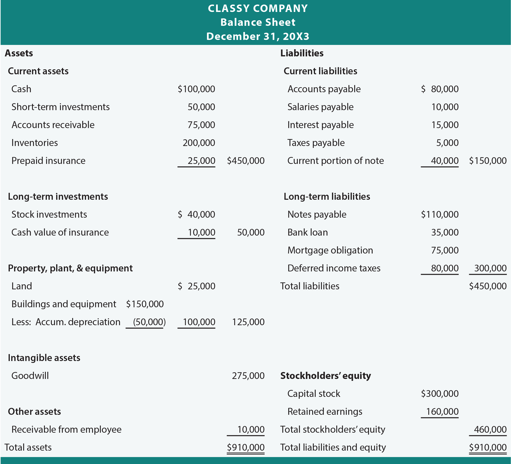

# A closer Look at the Financial Statements

- This chapter will show you how to write financial statements

## A Story that Builds a Set of Financial Statements

- __business plan__: a document designed to show investors that your business can make money.
  - Aka, your revenues will exceed your expenses

- __contributed capital__: equity invested in a business by its owners.
  - contributed capital generally comes with ownership rights

- Remember, loans come with:
  - principal
  - interest rate
  - a time period
  - possibly other conditions.

- __debt capital__: money you borrowed
  - A form of a liability

- __producing assets__: assets used to support generation of revenues that last at least a few years.
- __operating assets__: assets that generate revenues, but are used quickly and replaced often.

- income statement items: all revenues and expenses and the net incomes they generate
- dividends are taken out of a company's profit

## Gon Fishin's Financial Statements

### Balance Sheet and Income Statement

- The __balance sheet__ lists operating and producing assets of a company along with where they came from (debt or equity)
- The __income statement__ lists revenues and expenses.

### Statement of Cash Flows

- Cash flows in and out from 3 business categories: operating, investing and financing.
  - __cash flows from operating activities__
      - ex: cash collections from customers and clients for products or services; paying operating expenses ( wages, utilities, repairs) and includes interest paid on bank loans
  - __cash flows from investing activities__
      - ex: buying or selling producing assets.
  - __Cash flows from financing activities__
      - ex: cash from borrowing and shareholders, payments to creditors (excluding interest) and shareholders in the form of dividends or share buybacks

### Statement of Shareholders' Equity

- __statement of shareholders equity__: exchanges made with owners
  - __retained earnings__: earning reinvested by the owner
  - includes: dividends, stock purchases, retained earnings, etc.

## The classified balance sheet

- __Classified balance sheet__: A balance sheet where assets and liabilities are grouped into different sub-classifications

#### Classified Balance Sheet example:

### A Photograph of Financial Condition

- Balance sheet is AKA **statement of financial condition**
- Balance sheets are like a photo because they tell a company's financial condition at a particular point in time.

### Liquidity on the Balance Sheet

- GAAP puts more __liquid__ assets are at the top of the assets category
  - __liquidity__: how easily and quickly an asset can be converted to cash.
  - IFRS puts liquid assets at the bottom of the assets category.

- The liabilities are categorized the same way. 
  - Liabilities that must be paid sooner are listed at the top of the liabilities category.

### Current Assets

- __current assets__: assets that will be realized (become cash usually) within the year.
  - ex: cash, short-term investments, accounts receivable, inventory, and prepaid expenses.

#### Cash

- The cash a company currently has
  - All cash: savings, checking, and operating cash

### Short-Term Investments

- __Short-term investments__: securities that are **readily marketable** (can be sold immediately) and that management intents to sell within a year.
  - value is the market value on the balance sheet date

### Accounts Receivable

- __accounts receivable__: money owed to the company by customers.
  - AKA "credit sales" or "sales on account"

- Calculated by taking total receivables owed and subtracting an estimate for **uncollectibles** or **doubtful accounts**.

### Inventory

- __Inventory__: items or products on hand that the company intends to sell to customers.
  - AKA **merchandise inventory**
  - cost of inventory = min(purchase price, replacement price)

- __supplies inventory__: items used to support operations
  - ex: spare parts, office supplies...
  - cost = purchase price

### Prepaid Expenses

- __Prepaid expenses__: expenses paid for before they're used.
  - ex: rent, insurance...
  - considered assets (not expenses) because they will benefit a company in the future.
  - when prepaid expenses are used, they are converted to expenses and matched against revenues.
  - recorded at purchase price

### Long-Term Investments

- __Long-term investments__: investments that provide benefits for longer than a year.
  - ex: notes receivable, land, debt and equity securities.

- **Promissory notes**: contracts (formal, legally enforceable documents) that state:
  - the face value of the receivable
  - **maturity date**: the date the face value is due
  - and the periodic interest payments to be made while the note is outstanding.

- often companies will buy enough shares in smaller companies to exert a controlling influence and hold these shared for the long term.

### Long-Lived Assets

- __Long-lived assets__: see "producing assets"
  - __Property__: land the company conducts operations on.
    - recorded at cost of purchase, value isn't adjusted for appreciation.
  - __Plant and equipment__: structures used for operations.
    - ex: factories, machinery, warehouses, vehicles...
    - recorded value (__net book value__) = purchase cost - accumulated depreciation.
  - __Intangible assets__ have no physical substance
    - ex: copyrights, trademarked names, information, processes...
    - **goodwill**: the cost of purchasing another company over and above the total market price of that company's individual assets and liabilities. 
      - for example, when a company acquires a **subsidiary**, it records this value on its balance sheet
      - goodwill isn't amortized
    - intangible assets are recorded at cost of purchase
    - intangible assets are sometimes depreciate (like when patients expire)
      - in this case, __net book value__ = purchase price - **accumulated amortization**

### Current Liabilities

- __current liabilities__: obligations expected to be paid (or services expected to be performed) with current assets.
  - ex: accounts payable, wages payable, interest payable short-term notes payable, income taxes payable, current matureities of long-term debts, and unearned revenues (aka deferred revenue)

- __Accounts payable__: Any short-term obligations made on account.
  - ex: unpaid salaries and wages, merchandise that's bought on account, interest, income taxes...

- __Current maturities of long-term debts__: portions of long-term liabilities that are due in the short erm
  - for example, if the maturity date is coming up, or if principal amounts are due in installments

- __unearned revenue__: a revenue for which the corresponding service or product hasn't been delivered

### Long-term liabilities

- __long-term liabilities__: liabilities not due within the year.
  - often have promissory contracts
  - ex: long-term notes payable and bonds payable

- __long-term notes payable__: obligations on loans that are normally due in more than a year.

- __Bonds payable__: notes issued for cash to a large number of debe investors (bond holders)

### Shareholders' Equity

- __Shareholders' equity__: equity contributed by shareholders (owners)
  - includes:
    - __common stock__: stock issued to shareholders
    - __retained earning__: investments made by owners not withdrawing dividends
    - __treasury stock__: money paid to purchase previously issued common stock.
      - this is negative, because it reduces investments made by owners
  - aka contributed capital

## The Income Statement

- __Income statement__: measures performance over a __period__ of time
  - aka "statement of operations"
  - 3 categories: operating revenues, operating expenses, nonoperating revenues and expenses
  - **net earnings** = income - expenses
    - aka net income or loss, or profit, the "bottom line"

### Operating Revenues

- __operating revenue__: inflow of assets (or decrease in liabilities) due to a company's operating activities over a period of time.

- Common operating revenue accounts:
  - __Sales__  records asset increases from selling products or inventory.
    - aka "sales revenue"
  - __Fees earned__ records records asset increases from providing services
    - aka "service revenue"

### Operating Expenses

- __Operating expenses__ record the periodic outflow of assets (or creation of liabilities) required to generate operating revenues.
  - ex: expenses related to wages, rent, selling, depreciation and amortization

- The __cost of goods sold__ operating expense account represents the original cost of inventory items.

- Different companies include different operating expense accounts:
  - retail companies usually list cost of goods sold because it's large
  - manufacturing companies typically include only selling and administrative expenses because the cost of goods sold is a combination of materials, and labor...

- __depreciation__: an estimate of how much value an asset has lost over time.
  - tangible assets **depreciate**, intangible assets **amortize**

- match expenses to revenues

- Operating income = operating revenues - operating expenses
- note, operating income doesn't account for non-operating revenues and expenses. Non-operating revenues and expenses should be infrequent and not be affect the core business.

### Nonoperating Revenues and Expenses

- usually small as it's non-operating.

- Nonoperating revenues Includes: interest on bank accounts, rent collected on the rental of excess warehouse space, and book gains recognized when assets are sold for amounts that exceed those costs
- Nonoperating expenses includes: interest on outstanding loans and book losses recognized when assets other than inventory are sold for amounts that are less than their original costs.

## The Statement of cash flows

- 